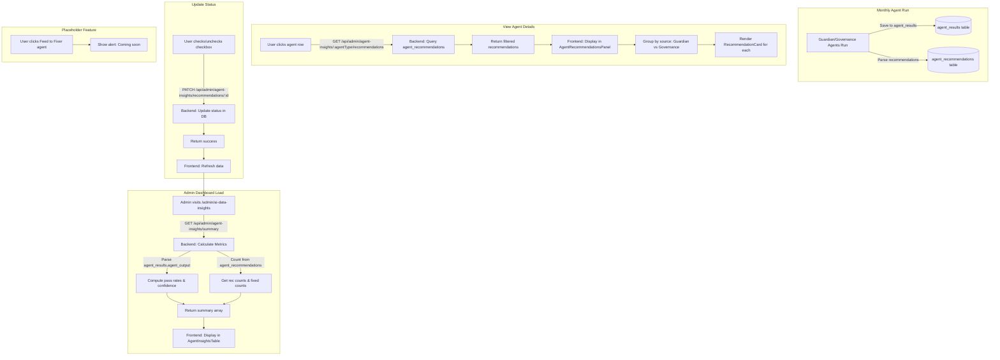

# AI Data Insights Dashboard - Full Implementation Plan

**Version**: 1.0  
**Date**: 2025-11-14  
**Project**: SignalsAI - Admin Agent Monitoring Dashboard

---

## 📋 TABLE OF CONTENTS

1. [Project Context](#project-context)
2. [Feature Overview](#feature-overview)
3. [Project Structure](#project-structure)
4. [Database Schema](#database-schema)
5. [Backend Implementation](#backend-implementation)
6. [Frontend Implementation](#frontend-implementation)
7. [Data Flow](#data-flow)
8. [Implementation Steps](#implementation-steps)
9. [Testing Guide](#testing-guide)
10. [Reference Files](#reference-files)

---

## 🎯 PROJECT CONTEXT

### Current System

This is a **dental practice management SaaS platform** with AI agents that analyze practice data and provide recommendations. The system has:

- **Backend**: Node.js/TypeScript/Express API (`signalsai-backend/`)
- **Frontend**: React/TypeScript (`signalsai/`)
- **Database**: PostgreSQL with Knex.js ORM
- **Existing Agents**: Proofline (daily), Summary (monthly), Opportunity (monthly), CRO Optimizer (monthly), GBP Optimizer (monthly)
- **New Agents**: Guardian & Governance Sentinel (monthly oversight agents)

### What We're Building

An **admin-only dashboard** at `/admin/ai-data-insights` that displays:

- Monthly performance metrics for each AI agent (pass rate, confidence, recommendations)
- Detailed view of Guardian and Governance Sentinel agent recommendations
- Ability to track and mark recommendations as completed
- Placeholder for future "Fixer Agent" feature

### Key Requirements

1. **System-wide monitoring**: Aggregate data across all client accounts
2. **Admin-only**: These recommendations are for internal team, not shown to clients
3. **Separate storage**: Store recommendations in dedicated table (not tasks table)
4. **Status tracking**: PENDING → COMPLETED workflow
5. **Two-panel UI**: Left = agent summary table, Right = detailed recommendations

---

## 🏗️ FEATURE OVERVIEW

### User Flow

```
1. Admin navigates to /admin/ai-data-insights
2. Left panel shows table of agents with metrics:
   - Agent Name (Proofline, Opportunity, Summary, CRO Optimizer)
   - Confidence Rate (avg from agent outputs)
   - Pass Rate (% of PASS verdicts)
   - # of Recommendations
   - # Fixed
   - "View more" button
3. Click agent row → Right panel populates with recommendations
4. Right panel shows two sections:
   - Governance Agent recommendations
   - Guardian Agent recommendations
5. Each recommendation card has:
   - Title & description
   - "Feed to Fixer agent" button (placeholder, non-functional)
   - Checkbox to mark as completed
6. Admin can check/uncheck to update status
```

### UI Wireframe Reference

```
┌─────────────────────────────────┬─────────────────────────────────┐
│  AI Data Insights Dashboard     │  Opportunity Agent Insights     │
│  November                        │                          Fix all│
│                                  │                                 │
│  ┌────────────────────────────┐ │  Governance Agent               │
│  │Agent │ Conf │Pass│#Rec│Fix │ │  ┌────────────────────────────┐│
│  │Proof │ 0.86 │99% │ 0  │ 0  │ │  │improve q1,q3 gold Qs  [Fx]☑││
│  │Opp   │ 0.72 │20% │ 5  │ 3  │ │  │rollback proofline     [Fx]☑││
│  │CRO Op│ 0.89 │97% │ 0  │ 0  │ │  │improve q1,q3 gold Qs  [Fx]☐││
│  │Summ  │ 0.90 │98% │ 1  │ 0  │ │  └────────────────────────────┘│
│  └────────────────────────────┘ │                                 │
│                                  │  Guardian Agent                 │
│                                  │  ┌────────────────────────────┐│
│                                  │  │improve q1,q3 gold Qs  [Fx]☑││
│                                  │  │improve q1,q3 gold Qs  [Fx]☐││
│                                  │  └────────────────────────────┘│
└─────────────────────────────────┴─────────────────────────────────┘
```

---

## 📁 PROJECT STRUCTURE

### Backend (`signalsai-backend/`)

```
signalsai-backend/
├── src/
│   ├── routes/
│   │   ├── agentsV2.ts              ← MODIFY: Add recommendation parsing
│   │   ├── adminAgentInsights.ts    ← CREATE: New API routes
│   │   └── [other routes]
│   ├── database/
│   │   └── connection.ts
│   ├── index.ts                     ← MODIFY: Register new route
│   └── logs/
├── migrations/
│   └── [timestamp]_agent_recommendations.sql  ← CREATE: New migration
├── .env                             ← Already has webhook URLs
└── package.json
```

### Frontend (`signalsai/`)

```
signalsai/
├── src/
│   ├── pages/
│   │   └── admin/
│   │       ├── AIDataInsights.tsx            ← CREATE: Main page
│   │       └── [other admin pages]
│   ├── components/
│   │   └── admin/
│   │       ├── AgentInsightsTable.tsx        ← CREATE: Left panel
│   │       ├── AgentRecommendationsPanel.tsx ← CREATE: Right panel
│   │       ├── RecommendationCard.tsx        ← CREATE: Card component
│   │       └── [other admin components]
│   ├── types/
│   │   ├── agentInsights.ts                  ← CREATE: TypeScript types
│   │   └── [other types]
│   └── App.tsx                               ← MODIFY: Add route
└── package.json
```

---

## 💾 DATABASE SCHEMA

### New Table: `agent_recommendations`

**Purpose**: Store individual recommendations from Guardian and Governance Sentinel agents for tracking and status management.

**Migration File**: `migrations/YYYYMMDDHHMMSS_create_agent_recommendations.sql`

```sql
-- Create agent_recommendations table
CREATE TABLE agent_recommendations (
    -- Primary key
    id SERIAL PRIMARY KEY,

    -- Relationship to guardian/governance run
    agent_result_id INTEGER NOT NULL REFERENCES agent_results(id) ON DELETE CASCADE,
    source_agent_type VARCHAR(50) NOT NULL CHECK (source_agent_type IN ('guardian', 'governance_sentinel')),
    agent_under_test VARCHAR(50) NOT NULL,

    -- Recommendation details
    title VARCHAR(500) NOT NULL,
    explanation TEXT,
    type VARCHAR(50), -- 'ALLORO', 'USER', etc.
    category VARCHAR(100), -- 'Operational', 'Experience'
    urgency VARCHAR(50), -- 'Immediate', 'Next Visit'
    severity INTEGER DEFAULT 1,

    -- Governance/Guardian specific fields
    verdict VARCHAR(50), -- 'PASS', 'FAIL', 'PENDING_VERIFICATION', 'PENDING_REVIEW'
    confidence DECIMAL(3,2) CHECK (confidence >= 0 AND confidence <= 1), -- 0.00 to 1.00

    -- Tracking
    status VARCHAR(50) DEFAULT 'PENDING' CHECK (status IN ('PENDING', 'COMPLETED')),

    -- Metadata (JSON fields)
    evidence_links JSONB DEFAULT '[]'::jsonb, -- Array of {url, label}
    rule_reference TEXT,
    suggested_action TEXT,
    escalation_required BOOLEAN DEFAULT FALSE,

    -- Timestamps
    observed_at TIMESTAMP,
    created_at TIMESTAMP DEFAULT NOW(),
    updated_at TIMESTAMP DEFAULT NOW(),
    completed_at TIMESTAMP,

    -- Constraints
    CONSTRAINT valid_confidence CHECK (confidence IS NULL OR (confidence >= 0 AND confidence <= 1))
);

-- Create indexes for performance
CREATE INDEX idx_agent_recommendations_result_id ON agent_recommendations(agent_result_id);
CREATE INDEX idx_agent_recommendations_under_test ON agent_recommendations(agent_under_test);
CREATE INDEX idx_agent_recommendations_source ON agent_recommendations(source_agent_type);
CREATE INDEX idx_agent_recommendations_status ON agent_recommendations(status);
CREATE INDEX idx_agent_recommendations_observed ON agent_recommendations(observed_at DESC);
CREATE INDEX idx_agent_recommendations_created ON agent_recommendations(created_at DESC);

-- Add comment for documentation
COMMENT ON TABLE agent_recommendations IS 'Stores individual recommendations from Guardian and Governance Sentinel agents for admin oversight';
COMMENT ON COLUMN agent_recommendations.agent_result_id IS 'References the parent guardian or governance_sentinel result in agent_results table';
COMMENT ON COLUMN agent_recommendations.agent_under_test IS 'The agent being analyzed (proofline, opportunity, summary, cro_optimizer)';
COMMENT ON COLUMN agent_recommendations.status IS 'PENDING or COMPLETED - tracks whether admin has addressed the recommendation';
```

### Existing Table: `agent_results`

**Already exists** - stores all agent run results. Guardian and Governance results are saved here with:

- `agent_type` = 'guardian' or 'governance_sentinel'
- `domain` = 'SYSTEM'
- `google_account_id` = NULL
- `agent_output` = JSON array of recommendations grouped by agent_under_test

**Reference Structure** of Guardian/Governance output in `agent_output`:

```json
[
  {
    "agent_under_test": "opportunity",
    "recommendations": [
      {
        "checks": [...],
        "lineage": "opportunity-agent.2025-11-11",
        "verdict": "PASS",
        "confidence": 0.765,
        "recommendations": [
          {
            "type": "USER",
            "title": "Audit October walk-in referrals",
            "urgency": "Immediate",
            "category": "Operational",
            "severity": 1,
            "explanation": "Review PMS October walk-in referral entries...",
            "evidence_links": [{"url": "pms://...", "label": "PMS Monthly Rollup"}],
            "rule_reference": "Referral Context & Precision Rules",
            "escalation_required": false
          }
        ]
      }
    ]
  }
]
```

---

## 🔧 BACKEND IMPLEMENTATION

### Step 1: Add Recommendation Parsing to Guardian/Governance Run

**File**: `src/routes/agentsV2.ts`

**Location**: After saving Guardian and Governance results to database (around line 2495, after `governanceId` is created)

**Add this function** before the endpoint:

```typescript
/**
 * Parse and save recommendations from Guardian and Governance agent outputs
 * to the agent_recommendations table for admin tracking
 */
async function saveRecommendationsFromAgents(
  guardianResultId: number,
  governanceResultId: number,
  guardianResults: any[],
  governanceResults: any[]
): Promise<void> {
  const recommendations: any[] = [];

  log(`[GUARDIAN-GOV] Parsing recommendations for database storage...`);

  // ============================================================
  // Process Guardian recommendations
  // ============================================================
  for (const result of guardianResults) {
    const agentUnderTest = result.agent_under_test;

    if (!result.recommendations || !Array.isArray(result.recommendations)) {
      log(
        `  [WARNING] No recommendations array for guardian/${agentUnderTest}`
      );
      continue;
    }

    for (const rec of result.recommendations) {
      // Guardian output structure: recommendations is array of objects,
      // each object has a nested 'recommendations' array
      const nestedRecs = Array.isArray(rec.recommendations)
        ? rec.recommendations
        : [rec];

      for (const item of nestedRecs) {
        // Skip if essential fields are missing
        if (!item.title) {
          log(`  [WARNING] Skipping guardian recommendation without title`);
          continue;
        }

        recommendations.push({
          agent_result_id: guardianResultId,
          source_agent_type: "guardian",
          agent_under_test: agentUnderTest,
          title: item.title,
          explanation: item.explanation || null,
          type: item.type || null,
          category: item.category || null,
          urgency: item.urgency || null,
          severity: item.severity || rec.severity || 1,
          verdict: rec.verdict || null,
          confidence: rec.confidence || null,
          status: "PENDING",
          evidence_links: JSON.stringify(item.evidence_links || []),
          rule_reference:
            item.rule_reference || rec.citations?.join("; ") || null,
          suggested_action: item.suggested_action || null,
          escalation_required: item.escalation_required || false,
          observed_at: rec.observed_at ? new Date(rec.observed_at) : new Date(),
          created_at: new Date(),
          updated_at: new Date(),
        });
      }
    }
  }

  log(
    `  [GUARDIAN-GOV] Parsed ${recommendations.length} Guardian recommendations`
  );

  // ============================================================
  // Process Governance recommendations
  // ============================================================
  for (const result of governanceResults) {
    const agentUnderTest = result.agent_under_test;

    if (!result.recommendations || !Array.isArray(result.recommendations)) {
      log(
        `  [WARNING] No recommendations array for governance/${agentUnderTest}`
      );
      continue;
    }

    for (const rec of result.recommendations) {
      // Governance output structure: similar to Guardian
      const nestedRecs = Array.isArray(rec.recommendations)
        ? rec.recommendations
        : [rec];

      for (const item of nestedRecs) {
        if (!item.title) {
          log(`  [WARNING] Skipping governance recommendation without title`);
          continue;
        }

        recommendations.push({
          agent_result_id: governanceResultId,
          source_agent_type: "governance_sentinel",
          agent_under_test: agentUnderTest,
          title: item.title,
          explanation: item.explanation || null,
          type: item.type || null,
          category: item.category || null,
          urgency: item.urgency || null,
          severity: item.severity || rec.severity || 1,
          verdict: rec.verdict || null,
          confidence: rec.confidence || null,
          status: "PENDING",
          evidence_links: JSON.stringify(item.evidence_links || []),
          rule_reference:
            item.rule_reference || rec.citations?.join("; ") || null,
          suggested_action: item.suggested_action || null,
          escalation_required: item.escalation_required || false,
          observed_at: rec.observed_at ? new Date(rec.observed_at) : new Date(),
          created_at: new Date(),
          updated_at: new Date(),
        });
      }
    }
  }

  log(
    `  [GUARDIAN-GOV] Parsed ${
      recommendations.length -
      (recommendations.length -
        governanceResults.reduce(
          (acc, r) => acc + (r.recommendations?.length || 0),
          0
        ))
    } Governance recommendations`
  );

  // ============================================================
  // Bulk insert all recommendations
  // ============================================================
  if (recommendations.length > 0) {
    try {
      await db("agent_recommendations").insert(recommendations);
      log(
        `[GUARDIAN-GOV] ✓ Saved ${recommendations.length} total recommendations to database`
      );
    } catch (error: any) {
      logError("saveRecommendationsFromAgents - Database Insert", error);
      // Don't fail the entire process if recommendation saving fails
      log(
        `[GUARDIAN-GOV] ⚠ Failed to save recommendations, but agent run succeeded`
      );
    }
  } else {
    log(`[GUARDIAN-GOV] No recommendations to save`);
  }
}
```

**Add this call** after saving both guardian and governance results (after line with `governanceId`):

```typescript
const governanceId = governanceRecord.id;
log(`[GUARDIAN-GOV] ✓ Governance result saved (ID: ${governanceId})`);

// NEW CODE: Parse and save recommendations
try {
  await saveRecommendationsFromAgents(
    guardianId,
    governanceId,
    guardianResults,
    governanceResults
  );
} catch (recError: any) {
  // Log but don't fail the entire process
  logError("Recommendation parsing", recError);
  log(`[GUARDIAN-GOV] ⚠ Recommendation parsing failed but agent run succeeded`);
}

const duration = Date.now() - startTime;
```

---

### Step 2: Create Admin Agent Insights API Routes

**File**: `src/routes/adminAgentInsights.ts` (NEW FILE)

```typescript
/**
 * Admin Agent Insights API Routes
 *
 * Endpoints for viewing Guardian and Governance Sentinel agent recommendations
 * and tracking their status (PENDING/COMPLETED)
 */

import express, { Request, Response } from "express";
import { db } from "../database/connection";

const router = express.Router();

// =====================================================================
// GET /api/admin/agent-insights/summary
// =====================================================================
/**
 * Returns summary statistics for current month's agents
 *
 * Query params:
 *   - month: Optional YYYY-MM format (defaults to current month)
 *
 * Returns per agent_under_test:
 *   - pass_rate: Percentage of PASS verdicts from agent outputs
 *   - confidence_rate: Average confidence score
 *   - total_recommendations: Count from agent_recommendations table
 *   - fixed_count: Count where status = 'COMPLETED'
 */
router.get("/summary", async (req: Request, res: Response) => {
  try {
    const { month } = req.query;

    // Determine date range
    const now = new Date();
    const startDate = month
      ? `${month}-01`
      : new Date(now.getFullYear(), now.getMonth(), 1)
          .toISOString()
          .split("T")[0];

    const endOfMonth = month
      ? new Date(
          new Date(month + "-01").getFullYear(),
          new Date(month + "-01").getMonth() + 1,
          0
        )
      : new Date(now.getFullYear(), now.getMonth() + 1, 0);
    const endDate = endOfMonth.toISOString().split("T")[0];

    console.log(
      `[Admin Agent Insights] Fetching summary for ${startDate} to ${endDate}`
    );

    // Fetch guardian and governance results for this month
    const agentResults = await db("agent_results")
      .whereIn("agent_type", ["guardian", "governance_sentinel"])
      .whereBetween("date_start", [startDate, endDate])
      .where("status", "success")
      .select("*");

    if (agentResults.length === 0) {
      console.log(
        "[Admin Agent Insights] No guardian/governance results found for this period"
      );
      return res.json({
        success: true,
        data: [],
        message: "No agent results found for this period",
      });
    }

    console.log(
      `[Admin Agent Insights] Found ${agentResults.length} guardian/governance results`
    );

    // Parse agent outputs and calculate metrics per agent_under_test
    const metricsMap: Record<
      string,
      {
        agent_type: string;
        total_checks: number;
        pass_count: number;
        fail_count: number;
        pending_count: number;
        confidence_sum: number;
        confidence_count: number;
      }
    > = {};

    for (const result of agentResults) {
      let output: any[];

      try {
        output =
          typeof result.agent_output === "string"
            ? JSON.parse(result.agent_output)
            : result.agent_output;
      } catch (parseError) {
        console.error(
          `Failed to parse agent_output for result ${result.id}:`,
          parseError
        );
        continue;
      }

      if (!Array.isArray(output)) {
        console.warn(`agent_output for result ${result.id} is not an array`);
        continue;
      }

      for (const item of output) {
        const agentType = item.agent_under_test;

        if (!agentType) {
          console.warn(`Missing agent_under_test in result ${result.id}`);
          continue;
        }

        // Initialize metrics for this agent type
        if (!metricsMap[agentType]) {
          metricsMap[agentType] = {
            agent_type: agentType,
            total_checks: 0,
            pass_count: 0,
            fail_count: 0,
            pending_count: 0,
            confidence_sum: 0,
            confidence_count: 0,
          };
        }

        const metrics = metricsMap[agentType];

        // Process recommendations array
        const recommendations = item.recommendations || [];
        for (const rec of recommendations) {
          metrics.total_checks++;

          // Count verdict types
          const verdict = rec.verdict?.toUpperCase();
          if (verdict === "PASS") {
            metrics.pass_count++;
          } else if (verdict === "FAIL") {
            metrics.fail_count++;
          } else {
            metrics.pending_count++;
          }

          // Sum confidence scores
          if (rec.confidence !== null && rec.confidence !== undefined) {
            metrics.confidence_sum += rec.confidence;
            metrics.confidence_count++;
          }
        }
      }
    }

    // Get recommendation counts from agent_recommendations table
    const recCounts = await db("agent_recommendations")
      .select("agent_under_test")
      .count("* as total")
      .sum(
        db.raw("CASE WHEN status = ? THEN 1 ELSE 0 END as fixed", ["COMPLETED"])
      )
      .groupBy("agent_under_test");

    // Combine metrics
    const summary = Object.keys(metricsMap).map((agentType) => {
      const m = metricsMap[agentType];
      const recData = recCounts.find(
        (r) => r.agent_under_test === agentType
      ) || {
        total: "0",
        fixed: "0",
      };

      return {
        agent_type: agentType,
        pass_rate: m.total_checks > 0 ? m.pass_count / m.total_checks : 0,
        confidence_rate:
          m.confidence_count > 0 ? m.confidence_sum / m.confidence_count : 0,
        total_recommendations: parseInt(String(recData.total)) || 0,
        fixed_count: parseInt(String(recData.fixed)) || 0,
      };
    });

    console.log(
      `[Admin Agent Insights] Returning summary for ${summary.length} agent types`
    );

    return res.json({
      success: true,
      data: summary,
      period: { startDate, endDate },
    });
  } catch (error: any) {
    console.error("[Admin Agent Insights] Error fetching summary:", error);
    return res.status(500).json({
      success: false,
      error: "FETCH_ERROR",
      message: error?.message || "Failed to fetch agent insights summary",
    });
  }
});

// =====================================================================
// GET /api/admin/agent-insights/:agentType/recommendations
// =====================================================================
/**
 * Returns all recommendations for a specific agent_under_test
 *
 * Path params:
 *   - agentType: The agent to get recommendations for (e.g., 'opportunity')
 *
 * Query params:
 *   - source: Filter by 'guardian' or 'governance_sentinel' or 'all' (default: all)
 *   - status: Filter by 'PENDING' or 'COMPLETED' or 'all' (default: all)
 */
router.get(
  "/:agentType/recommendations",
  async (req: Request, res: Response) => {
    try {
      const { agentType } = req.params;
      const { source = "all", status = "all" } = req.query;

      console.log(
        `[Admin Agent Insights] Fetching recommendations for ${agentType}, source=${source}, status=${status}`
      );

      let query = db("agent_recommendations")
        .where("agent_under_test", agentType)
        .orderBy("created_at", "desc");

      // Apply source filter
      if (source && source !== "all") {
        query = query.where("source_agent_type", source as string);
      }

      // Apply status filter
      if (status && status !== "all") {
        query = query.where("status", status as string);
      }

      const recommendations = await query.select("*");

      // Parse JSON fields
      const parsedRecommendations = recommendations.map((rec) => ({
        ...rec,
        evidence_links:
          typeof rec.evidence_links === "string"
            ? JSON.parse(rec.evidence_links)
            : rec.evidence_links,
      }));

      console.log(
        `[Admin Agent Insights] Found ${parsedRecommendations.length} recommendations`
      );

      return res.json({
        success: true,
        data: parsedRecommendations,
      });
    } catch (error: any) {
      console.error(
        "[Admin Agent Insights] Error fetching recommendations:",
        error
      );
      return res.status(500).json({
        success: false,
        error: "FETCH_ERROR",
        message: error?.message || "Failed to fetch recommendations",
      });
    }
  }
);

// =====================================================================
// PATCH /api/admin/agent-insights/recommendations/:id
// =====================================================================
/**
 * Update recommendation status (PENDING <-> COMPLETED)
 *
 * Path params:
 *   - id: The recommendation ID
 *
 * Body:
 *   - status: 'PENDING' or 'COMPLETED'
 */
router.patch("/recommendations/:id", async (req: Request, res: Response) => {
  try {
    const { id } = req.params;
    const { status } = req.body;

    // Validate status
    if (!status || !["PENDING", "COMPLETED"].includes(status)) {
      return res.status(400).json({
        success: false,
        error: "INVALID_STATUS",
        message: "Status must be PENDING or COMPLETED",
      });
    }

    console.log(
      `[Admin Agent Insights] Updating recommendation ${id} to status ${status}`
    );

    // Check if recommendation exists
    const existing = await db("agent_recommendations").where("id", id).first();
    if (!existing) {
      return res.status(404).json({
        success: false,
        error: "NOT_FOUND",
        message: "Recommendation not found",
      });
    }

    // Build update object
    const updates: any = {
      status,
      updated_at: new Date(),
    };

    // Set completed_at timestamp when marking as completed
    if (status === "COMPLETED") {
      updates.completed_at = new Date();
    } else if (status === "PENDING") {
      // Clear completed_at when marking back to pending
      updates.completed_at = null;
    }

    // Update in database
    await db("agent_recommendations").where("id", id).update(updates);

    console.log(`[Admin Agent Insights] ✓ Updated recommendation ${id}`);

    return res.json({
      success: true,
      message: "Recommendation status updated successfully",
      data: { id, status },
    });
  } catch (error: any) {
    console.error(
      "[Admin Agent Insights] Error updating recommendation:",
      error
    );
    return res.status(500).json({
      success: false,
      error: "UPDATE_ERROR",
      message: error?.message || "Failed to update recommendation",
    });
  }
});

// =====================================================================
// EXPORTS
// =====================================================================

export default router;
```

---

### Step 3: Register New Route in Main App

**File**: `src/index.ts`

**Find the section** where routes are registered (look for lines like `app.use('/api/agents', agentsRoutes)`), and add:

```typescript
import adminAgentInsightsRoutes from "./routes/adminAgentInsights";

// ... other imports and setup ...

// Register routes
app.use("/api/agents", agentsRoutes);
app.use("/api/admin/agent-insights", adminAgentInsightsRoutes); // ADD THIS LINE
// ... other routes ...
```

---

## 🎨 FRONTEND IMPLEMENTATION

### Step 1: Create TypeScript Types

**File**: `signalsai/src/types/agentInsights.ts` (NEW FILE)

```typescript
/**
 * TypeScript interfaces for Admin Agent Insights feature
 */

export interface AgentInsightSummary {
  agent_type: string;
  pass_rate: number; // 0 to 1
  confidence_rate: number; // 0 to 1
  total_recommendations: number;
  fixed_count: number;
}

export interface AgentRecommendation {
  id: number;
  agent_result_id: number;
  source_agent_type: "guardian" | "governance_sentinel";
  agent_under_test: string;

  // Recommendation details
  title: string;
  explanation: string | null;
  type: string | null; // 'ALLORO', 'USER', etc.
  category: string | null; // 'Operational', 'Experience'
  urgency: string | null; // 'Immediate', 'Next Visit'
  severity: number;

  // Governance/Guardian fields
  verdict: string | null; // 'PASS', 'FAIL', 'PENDING_VERIFICATION', etc.
  confidence: number | null; // 0 to 1

  // Tracking
  status: "PENDING" | "COMPLETED";

  // Metadata
  evidence_links: Array<{ url: string; label: string }>;
  rule_reference: string | null;
  suggested_action: string | null;
  escalation_required: boolean;

  // Timestamps
  observed_at: string;
  created_at: string;
  updated_at: string;
  completed_at: string | null;
}

export interface AgentInsightsSummaryResponse {
  success: boolean;
  data: AgentInsightSummary[];
  period?: {
    startDate: string;
    endDate: string;
  };
  message?: string;
}

export interface AgentRecommendationsResponse {
  success: boolean;
  data: AgentRecommendation[];
}
```

---

### Step 2: Main Page Component

**File**: `signalsai/src/pages/admin/AIDataInsights.tsx` (NEW FILE)

```typescript
import React, { useState, useEffect } from "react";
import AgentInsightsTable from "../../components/admin/AgentInsightsTable";
import AgentRecommendationsPanel from "../../components/admin/AgentRecommendationsPanel";
import { AgentInsightSummary } from "../../types/agentInsights";

/**
 * AI Data Insights Dashboard
 *
 * Admin-only page showing Guardian and Governance Sentinel agent
 * recommendations for quality assurance and oversight
 */
export default function AIDataInsights() {
  const [summaryData, setSummaryData] = useState<AgentInsightSummary[]>([]);
  const [selectedAgent, setSelectedAgent] = useState<string | null>(null);
  const [loading, setLoading] = useState(true);
  const [error, setError] = useState<string | null>(null);

  useEffect(() => {
    fetchSummary();
  }, []);

  const fetchSummary = async () => {
    setLoading(true);
    setError(null);

    try {
      const response = await fetch("/api/admin/agent-insights/summary");
      const data = await response.json();

      if (data.success) {
        setSummaryData(data.data);

        // Auto-select first agent if available
        if (data.data.length > 0 && !selectedAgent) {
          setSelectedAgent(data.data[0].agent_type);
        }
      } else {
        setError(data.message || "Failed to fetch summary");
      }
    } catch (err: any) {
      console.error("Failed to fetch agent insights summary:", err);
      setError("Failed to load agent insights. Please try again.");
    } finally {
      setLoading(false);
    }
  };

  return (
    <div className="flex h-screen bg-gray-900 text-white">
      {/* Left Panel - Agent Summary Table */}
      <div className="w-1/2 p-6 border-r border-gray-700 overflow-y-auto">
        <AgentInsightsTable
          data={summaryData}
          selectedAgent={selectedAgent}
          onSelectAgent={setSelectedAgent}
          loading={loading}
          error={error}
        />
      </div>

      {/* Right Panel - Recommendations */}
      <div className="w-1/2 p-6 overflow-y-auto">
        {selectedAgent ? (
          <AgentRecommendationsPanel
            agentType={selectedAgent}
            onRefresh={fetchSummary}
          />
        ) : (
          <div className="flex items-center justify-center h-full">
            <div className="text-center text-gray-500">
              <p className="text-lg mb-2">No agent selected</p>
              <p className="text-sm">
                Click on an agent in the table to view recommendations
              </p>
            </div>
          </div>
        )}
      </div>
    </div>
  );
}
```

---

### Step 3: Agent Insights Table Component

**File**: `signalsai/src/components/admin/AgentInsightsTable.tsx` (NEW FILE)

```typescript
import React from "react";
import { AgentInsightSummary } from "../../types/agentInsights";

interface Props {
  data: AgentInsightSummary[];
  selectedAgent: string | null;
  onSelectAgent: (agent: string) => void;
  loading: boolean;
  error: string | null;
}

/**
 * Table showing summary metrics for each agent type
 * Left panel of AI Data Insights Dashboard
 */
export default function AgentInsightsTable({
  data,
  selectedAgent,
  onSelectAgent,
  loading,
  error,
}: Props) {
  // Format agent name for display
  const formatAgentName = (agentType: string): string => {
    return agentType
      .split("_")
      .map((word) => word.charAt(0).toUpperCase() + word.slice(1))
      .join(" ");
  };

  if (loading) {
    return (
      <div className="flex items-center justify-center h-64">
        <div className="text-gray-400">Loading agent insights...</div>
      </div>
    );
  }

  if (error) {
    return (
      <div className="flex items-center justify-center h-64">
        <div className="text-red-400">
          <p className="font-semibold mb-2">Error loading data</p>
          <p className="text-sm">{error}</p>
        </div>
      </div>
    );
  }

  if (data.length === 0) {
    return (
      <div className="flex items-center justify-center h-64">
        <div className="text-gray-400 text-center">
          <p className="text-lg mb-2">No agent data available</p>
          <p className="text-sm">
            Guardian and Governance agents haven't run yet this month
          </p>
        </div>
      </div>
    );
  }

  return (
    <div>
      {/* Header */}
      <div className="mb-6">
        <h1 className="text-2xl font-bold text-white mb-1">
          AI Data Insights Dashboard
        </h1>
        <p className="text-gray-400">
          {new Date().toLocaleDateString("en-US", {
            month: "long",
            year: "numeric",
          })}
        </p>
      </div>

      {/* Table */}
      <div className="bg-gray-800 rounded-lg overflow-hidden border border-gray-700">
        <table className="w-full">
          <thead>
            <tr className="text-left text-gray-400 bg-gray-800 border-b border-gray-700">
              <th className="py-3 px-4 font-medium">Agent</th>
              <th className="py-3 px-4 font-medium">Confidence Rate</th>
              <th className="py-3 px-4 font-medium">Pass Rate</th>
              <th className="py-3 px-4 font-medium"># of Recommendations</th>
              <th className="py-3 px-4 font-medium">Fixed</th>
              <th className="py-3 px-4 font-medium"></th>
            </tr>
          </thead>
          <tbody>
            {data.map((agent, index) => (
              <tr
                key={agent.agent_type}
                className={`
                  cursor-pointer transition-colors
                  ${
                    selectedAgent === agent.agent_type
                      ? "bg-gray-700"
                      : "hover:bg-gray-750"
                  }
                  ${index < data.length - 1 ? "border-b border-gray-700" : ""}
                `}
                onClick={() => onSelectAgent(agent.agent_type)}
              >
                <td className="py-4 px-4 font-medium">
                  {formatAgentName(agent.agent_type)}
                </td>
                <td className="py-4 px-4">
                  {agent.confidence_rate.toFixed(2)}
                </td>
                <td className="py-4 px-4">
                  {(agent.pass_rate * 100).toFixed(0)}%
                </td>
                <td className="py-4 px-4">{agent.total_recommendations}</td>
                <td className="py-4 px-4">{agent.fixed_count}</td>
                <td className="py-4 px-4">
                  <button
                    className="text-blue-400 hover:text-blue-300 text-sm font-medium"
                    onClick={(e) => {
                      e.stopPropagation();
                      onSelectAgent(agent.agent_type);
                    }}
                  >
                    View more
                  </button>
                </td>
              </tr>
            ))}
          </tbody>
        </table>
      </div>

      {/* Legend */}
      <div className="mt-4 text-sm text-gray-400">
        <p className="mb-1">
          <strong>Pass Rate:</strong> Percentage of checks with PASS verdict
        </p>
        <p className="mb-1">
          <strong>Confidence Rate:</strong> Average confidence score from agent
          analysis
        </p>
        <p>
          <strong>Fixed:</strong> Number of recommendations marked as completed
        </p>
      </div>
    </div>
  );
}
```

---

### Step 4: Recommendations Panel Component

**File**: `signalsai/src/components/admin/AgentRecommendationsPanel.tsx` (NEW FILE)

```typescript
import React, { useState, useEffect } from "react";
import RecommendationCard from "./RecommendationCard";
import { AgentRecommendation } from "../../types/agentInsights";

interface Props {
  agentType: string;
  onRefresh: () => void;
}

/**
 * Right panel showing detailed recommendations for selected agent
 * Grouped by source (Governance vs Guardian)
 */
export default function AgentRecommendationsPanel({
  agentType,
  onRefresh,
}: Props) {
  const [recommendations, setRecommendations] = useState<AgentRecommendation[]>(
    []
  );
  const [loading, setLoading] = useState(true);
  const [error, setError] = useState<string | null>(null);

  useEffect(() => {
    fetchRecommendations();
  }, [agentType]);

  const fetchRecommendations = async () => {
    setLoading(true);
    setError(null);

    try {
      const response = await fetch(
        `/api/admin/agent-insights/${agentType}/recommendations?source=all`
      );
      const data = await response.json();

      if (data.success) {
        setRecommendations(data.data);
      } else {
        setError("Failed to load recommendations");
      }
    } catch (err) {
      console.error("Failed to fetch recommendations:", err);
      setError("Failed to load recommendations");
    } finally {
      setLoading(false);
    }
  };

  const handleRecommendationUpdate = () => {
    fetchRecommendations();
    onRefresh(); // Refresh parent to update counts
  };

  // Group recommendations by source
  const governanceRecs = recommendations.filter(
    (r) => r.source_agent_type === "governance_sentinel"
  );
  const guardianRecs = recommendations.filter(
    (r) => r.source_agent_type === "guardian"
  );

  // Format agent name
  const formatAgentName = (agentType: string): string => {
    return agentType
      .split("_")
      .map((word) => word.charAt(0).toUpperCase() + word.slice(1))
      .join(" ");
  };

  if (loading) {
    return (
      <div className="flex items-center justify-center h-64">
        <div className="text-gray-400">Loading recommendations...</div>
      </div>
    );
  }

  if (error) {
    return (
      <div className="flex items-center justify-center h-64">
        <div className="text-red-400">
          <p className="font-semibold mb-2">Error</p>
          <p className="text-sm">{error}</p>
        </div>
      </div>
    );
  }

  if (recommendations.length === 0) {
    return (
      <div className="flex items-center justify-center h-64">
        <div className="text-gray-400 text-center">
          <p className="text-lg mb-2">No recommendations</p>
          <p className="text-sm">
            No Guardian or Governance recommendations for{" "}
            {formatAgentName(agentType)}
          </p>
        </div>
      </div>
    );
  }

  return (
    <div>
      {/* Header */}
      <div className="flex justify-between items-center mb-6">
        <h2 className="text-xl font-bold text-white">
          {formatAgentName(agentType)} Agent Insights
        </h2>
        <button
          className="text-blue-400 hover:text-blue-300 text-sm font-medium px-3 py-1 border border-blue-400 rounded hover:bg-blue-400/10 transition-colors"
          onClick={() => {
            /* TODO: Future feature - mark all as fixed */
            alert("Fix all feature coming soon");
          }}
        >
          Fix all
        </button>
      </div>

      {/* Governance Agent Recommendations */}
      {governanceRecs.length > 0 && (
        <div className="mb-8">
          <h3 className="text-lg font-semibold text-white mb-4">
            Governance Agent
            <span className="ml-2 text-sm text-gray-400 font-normal">
              ({governanceRecs.length} recommendation
              {governanceRecs.length !== 1 ? "s" : ""})
            </span>
          </h3>
          <div className="space-y-3">
            {governanceRecs.map((rec) => (
              <RecommendationCard
                key={rec.id}
                recommendation={rec}
                onUpdate={handleRecommendationUpdate}
              />
            ))}
          </div>
        </div>
      )}

      {/* Guardian Agent Recommendations */}
      {guardianRecs.length > 0 && (
        <div>
          <h3 className="text-lg font-semibold text-white mb-4">
            Guardian Agent
            <span className="ml-2 text-sm text-gray-400 font-normal">
              ({guardianRecs.length} recommendation
              {guardianRecs.length !== 1 ? "s" : ""})
            </span>
          </h3>
          <div className="space-y-3">
            {guardianRecs.map((rec) => (
              <RecommendationCard
                key={rec.id}
                recommendation={rec}
                onUpdate={handleRecommendationUpdate}
              />
            ))}
          </div>
        </div>
      )}
    </div>
  );
}
```

---

### Step 5: Recommendation Card Component

**File**: `signalsai/src/components/admin/RecommendationCard.tsx` (NEW FILE)

```typescript
import React, { useState } from "react";
import { AgentRecommendation } from "../../types/agentInsights";

interface Props {
  recommendation: AgentRecommendation;
  onUpdate: () => void;
}

/**
 * Individual recommendation card with status checkbox
 * and placeholder "Feed to Fixer agent" button
 */
export default function RecommendationCard({
  recommendation,
  onUpdate,
}: Props) {
  const [isUpdating, setIsUpdating] = useState(false);
  const [isExpanded, setIsExpanded] = useState(false);

  const handleToggleStatus = async () => {
    if (isUpdating) return;

    setIsUpdating(true);

    try {
      const newStatus =
        recommendation.status === "PENDING" ? "COMPLETED" : "PENDING";

      const response = await fetch(
        `/api/admin/agent-insights/recommendations/${recommendation.id}`,
        {
          method: "PATCH",
          headers: { "Content-Type": "application/json" },
          body: JSON.stringify({ status: newStatus }),
        }
      );

      const data = await response.json();

      if (data.success) {
        onUpdate(); // Refresh parent data
      } else {
        alert("Failed to update status: " + (data.message || "Unknown error"));
      }
    } catch (error) {
      console.error("Failed to update recommendation status:", error);
      alert("Failed to update status. Please try again.");
    } finally {
      setIsUpdating(false);
    }
  };

  const handleFixerAgent = () => {
    // Placeholder for future feature
    alert("Fixer Agent feature is coming soon!");
  };

  return (
    <div className="border border-gray-700 rounded-lg bg-gray-800 overflow-hidden">
      {/* Card Header */}
      <div className="p-4">
        <div className="flex items-start justify-between gap-3">
          {/* Title */}
          <p className="flex-1 text-white font-medium leading-snug">
            {recommendation.title}
          </p>

          {/* Action Buttons */}
          <div className="flex items-center gap-2 flex-shrink-0">
            {/* Feed to Fixer Agent Button (Placeholder) */}
            <button
              onClick={handleFixerAgent}
              className="text-blue-400 hover:text-blue-300 text-xs font-medium px-2 py-1 border border-blue-400/50 rounded hover:bg-blue-400/10 transition-colors whitespace-nowrap"
              title="Coming soon"
            >
              Feed to Fixer agent
            </button>

            {/* Status Checkbox */}
            <button
              onClick={handleToggleStatus}
              disabled={isUpdating}
              className={`
                w-6 h-6 border-2 rounded flex items-center justify-center
                transition-all duration-200
                ${
                  recommendation.status === "COMPLETED"
                    ? "bg-green-500 border-green-500"
                    : "border-gray-500 hover:border-gray-400"
                }
                ${
                  isUpdating
                    ? "opacity-50 cursor-not-allowed"
                    : "cursor-pointer"
                }
              `}
              title={
                recommendation.status === "COMPLETED"
                  ? "Mark as pending"
                  : "Mark as completed"
              }
            >
              {recommendation.status === "COMPLETED" && (
                <svg
                  className="w-4 h-4 text-white"
                  fill="none"
                  stroke="currentColor"
                  viewBox="0 0 24 24"
                >
                  <path
                    strokeLinecap="round"
                    strokeLinejoin="round"
                    strokeWidth={3}
                    d="M5 13l4 4L19 7"
                  />
                </svg>
              )}
            </button>
          </div>
        </div>

        {/* Status Badge */}
        {recommendation.status === "PENDING" && (
          <div className="mt-2">
            <span className="inline-flex items-center px-2 py-1 text-xs font-medium bg-orange-500/20 text-orange-400 rounded border border-orange-500/30">
              Pending
            </span>
          </div>
        )}

        {/* Metadata Tags */}
        {(recommendation.urgency ||
          recommendation.category ||
          recommendation.severity > 1) && (
          <div className="mt-3 flex flex-wrap gap-2">
            {recommendation.urgency && (
              <span className="text-xs px-2 py-0.5 bg-gray-700 text-gray-300 rounded border border-gray-600">
                {recommendation.urgency}
              </span>
            )}
            {recommendation.category && (
              <span className="text-xs px-2 py-0.5 bg-gray-700 text-gray-300 rounded border border-gray-600">
                {recommendation.category}
              </span>
            )}
            {recommendation.severity > 1 && (
              <span className="text-xs px-2 py-0.5 bg-red-500/20 text-red-400 rounded border border-red-500/30">
                Severity {recommendation.severity}
              </span>
            )}
          </div>
        )}

        {/* Expand/Collapse Button */}
        {recommendation.explanation && (
          <button
            onClick={() => setIsExpanded(!isExpanded)}
            className="mt-3 text-sm text-blue-400 hover:text-blue-300 font-medium"
          >
            {isExpanded ? "Show less" : "Show details"}
          </button>
        )}
      </div>

      {/* Expanded Details */}
      {isExpanded && (
        <div className="px-4 pb-4 border-t border-gray-700 bg-gray-750">
          {/* Explanation */}
          {recommendation.explanation && (
            <div className="mt-4">
              <h4 className="text-sm font-semibold text-gray-300 mb-2">
                Explanation
              </h4>
              <p className="text-sm text-gray-400 leading-relaxed">
                {recommendation.explanation}
              </p>
            </div>
          )}

          {/* Suggested Action */}
          {recommendation.suggested_action && (
            <div className="mt-4">
              <h4 className="text-sm font-semibold text-gray-300 mb-2">
                Suggested Action
              </h4>
              <p className="text-sm text-gray-400 leading-relaxed">
                {recommendation.suggested_action}
              </p>
            </div>
          )}

          {/* Metadata Grid */}
          <div className="mt-4 grid grid-cols-2 gap-4">
            {recommendation.verdict && (
              <div>
                <h4 className="text-xs font-semibold text-gray-400 mb-1">
                  Verdict
                </h4>
                <p
                  className={`text-sm font-medium ${
                    recommendation.verdict === "PASS"
                      ? "text-green-400"
                      : recommendation.verdict === "FAIL"
                      ? "text-red-400"
                      : "text-yellow-400"
                  }`}
                >
                  {recommendation.verdict}
                </p>
              </div>
            )}

            {recommendation.confidence !== null && (
              <div>
                <h4 className="text-xs font-semibold text-gray-400 mb-1">
                  Confidence
                </h4>
                <p className="text-sm text-gray-300">
                  {(recommendation.confidence * 100).toFixed(0)}%
                </p>
              </div>
            )}

            {recommendation.type && (
              <div>
                <h4 className="text-xs font-semibold text-gray-400 mb-1">
                  Type
                </h4>
                <p className="text-sm text-gray-300">{recommendation.type}</p>
              </div>
            )}

            {recommendation.escalation_required && (
              <div>
                <h4 className="text-xs font-semibold text-gray-400 mb-1">
                  Escalation
                </h4>
                <p className="text-sm text-red-400">Required</p>
              </div>
            )}
          </div>

          {/* Evidence Links */}
          {recommendation.evidence_links &&
            recommendation.evidence_links.length > 0 && (
              <div className="mt-4">
                <h4 className="text-xs font-semibold text-gray-400 mb-2">
                  Evidence
                </h4>
                <ul className="space-y-1">
                  {recommendation.evidence_links.map((link, index) => (
                    <li key={index}>
                      <a
                        href={link.url}
                        className="text-sm text-blue-400 hover:text-blue-300 hover:underline"
                        target="_blank"
                        rel="noopener noreferrer"
                      >
                        {link.label || link.url}
                      </a>
                    </li>
                  ))}
                </ul>
              </div>
            )}

          {/* Rule Reference */}
          {recommendation.rule_reference && (
            <div className="mt-4">
              <h4 className="text-xs font-semibold text-gray-400 mb-1">
                Rule Reference
              </h4>
              <p className="text-xs text-gray-500">
                {recommendation.rule_reference}
              </p>
            </div>
          )}

          {/* Timestamps */}
          <div className="mt-4 text-xs text-gray-500">
            <p>
              Created: {new Date(recommendation.created_at).toLocaleString()}
            </p>
            {recommendation.completed_at && (
              <p>
                Completed:{" "}
                {new Date(recommendation.completed_at).toLocaleString()}
              </p>
            )}
          </div>
        </div>
      )}
    </div>
  );
}
```

---

### Step 6: Add Route to App

**File**: `signalsai/src/App.tsx` (or wherever routes are defined)

**Add the route** in the admin section:

```typescript
import AIDataInsights from "./pages/admin/AIDataInsights";

// Inside your Routes component:
<Route path="/admin/ai-data-insights" element={<AIDataInsights />} />;
```

**Also add navigation link** in admin sidebar/menu:

```typescript
<NavLink to="/admin/ai-data-insights" className="nav-link">
  AI Data Insights
</NavLink>
```

---

## 🔄 DATA FLOW



---

## 📝 IMPLEMENTATION STEPS

### Phase 1: Database Setup

1. **Create migration file**:

   ```bash
   # Backend directory
   cd signalsai-backend
   npx knex migrate:make create_agent_recommendations
   ```

2. **Copy SQL schema** from this document into the migration file

3. **Run migration**:

   ```bash
   npx knex migrate:latest
   ```

4. **Verify table created**:
   ```sql
   SELECT * FROM agent_recommendations LIMIT 1;
   ```

---

### Phase 2: Backend Implementation

5. **Update agentsV2.ts**:

   - Add `saveRecommendationsFromAgents()` function
   - Call it after saving guardian/governance results
   - Test by running `/guardian-governance-agents-run` endpoint

6. **Create adminAgentInsights.ts**:

   - Create new route file with 3 endpoints
   - Test each endpoint with Postman/curl:
     ```bash
     GET /api/admin/agent-insights/summary
     GET /api/admin/agent-insights/opportunity/recommendations
     PATCH /api/admin/agent-insights/recommendations/1
     ```

7. **Register route in index.ts**:
   - Add import and `app.use()` statement
   - Restart backend server
   - Verify routes are accessible

---

### Phase 3: Frontend Implementation

8. **Create types file**:

   - Create `signalsai/src/types/agentInsights.ts`
   - Copy interfaces from this document

9. **Create components** (in order):

   - `RecommendationCard.tsx` (leaf component)
   - `AgentRecommendationsPanel.tsx` (uses RecommendationCard)
   - `AgentInsightsTable.tsx` (standalone)
   - `AIDataInsights.tsx` (main page, uses both panels)

10. **Add route and navigation**:
    - Add route to App.tsx
    - Add nav link to admin menu
    - Test navigation

---

### Phase 4: Testing

11. **Test data flow**:
    - Run `/guardian-governance-agents-run` endpoint manually
    - Verify recommendations saved to database:
      ```sql
      SELECT * FROM agent_recommendations;
      ```
12. **Test frontend**:

    - Navigate to `/admin/ai-data-insights`
    - Verify table loads with correct metrics
    - Click agent row, verify recommendations load
    - Check/uncheck recommendation, verify status updates
    - Test "Feed to Fixer agent" shows alert

13. **Test edge cases**:
    - No guardian/governance data yet (empty state)
    - Agent with 0 recommendations
    - All recommendations completed
    - Network errors

---

### Phase 5: Styling & Polish

14. **Match design**:

    - Adjust colors to match dark theme
    - Ensure responsive layout
    - Add loading states
    - Add error states

15. **Add helpful features**:
    - Sort/filter recommendations
    - Search within recommendations
    - Export data
    - Bulk actions

---

## 🧪 TESTING GUIDE

### Manual Testing Checklist

**Backend**:

- [ ] Migration creates table successfully
- [ ] Guardian/governance run saves recommendations
- [ ] `/summary` endpoint returns correct metrics
- [ ] `/:agentType/recommendations` returns filtered data
- [ ] `PATCH /recommendations/:id` updates status
- [ ] Database constraints work (invalid status rejected)

**Frontend**:

- [ ] Page loads without errors
- [ ] Table shows all agent types
- [ ] Metrics calculate correctly
- [ ] Clicking row loads recommendations
- [ ] Recommendations grouped by source
- [ ] Checkbox toggles status
- [ ] Status persists after refresh
- [ ] "Feed to Fixer" shows alert
- [ ] Expand/collapse details works
- [ ] Empty states display properly
- [ ] Loading states appear
- [ ] Error states handle failures

**Integration**:

- [ ] End-to-end: Run guardian/governance → View in dashboard → Mark complete
- [ ] Multiple agents show correctly
- [ ] Switching between agents works
- [ ] Data refreshes when needed

---

## 📚 REFERENCE FILES

### Backend Files to Review

1. **`src/routes/agentsV2.ts`** (lines 2178-2562):

   - Current `/guardian-governance-agents-run` implementation
   - Shows how agent outputs are structured
   - Reference for adding recommendation parsing

2. **`src/database/connection.ts`**:

   - Database connection setup
   - Knex.js usage examples

3. **`src/routes/tasks.ts`**:

   - Similar CRUD operations for tasks
   - Pattern for API endpoints

4. **`src/index.ts`**:

   - How routes are registered
   - Middleware setup

5. **`.env`**:
   - Already has Guardian and Governance webhook URLs configured

### Frontend Files to Review

1. **`signalsai/src/components/admin/ActionItemsHub.tsx`**:

   - Existing admin component structure
   - Similar two-panel layout
   - Styling patterns to match

2. **`signalsai/src/components/tasks/TaskDetailsModal.tsx`**:

   - Modal/detail view patterns
   - Status management UI

3. \*\*`signalsai/src
