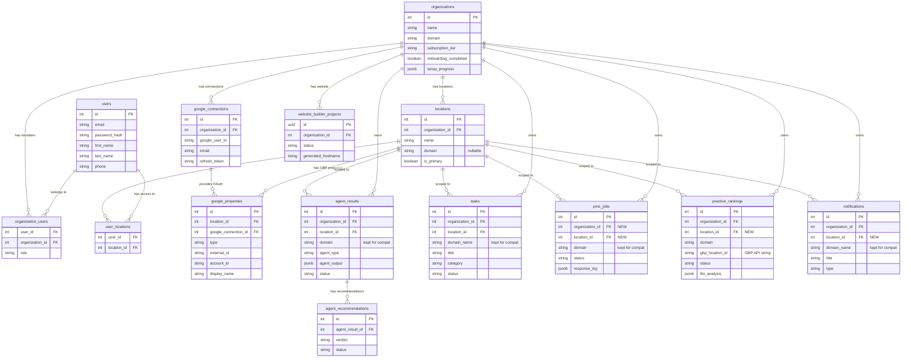
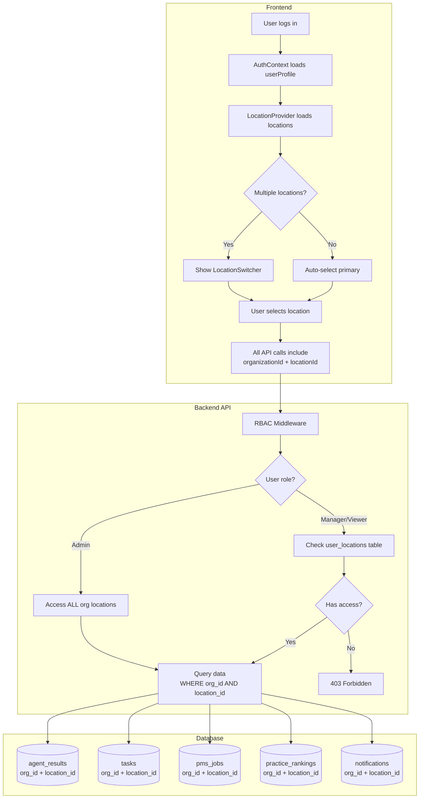
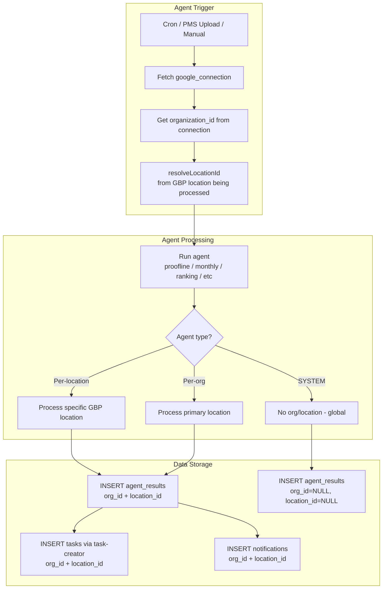
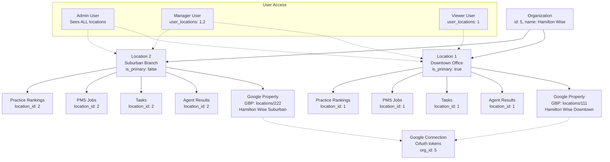
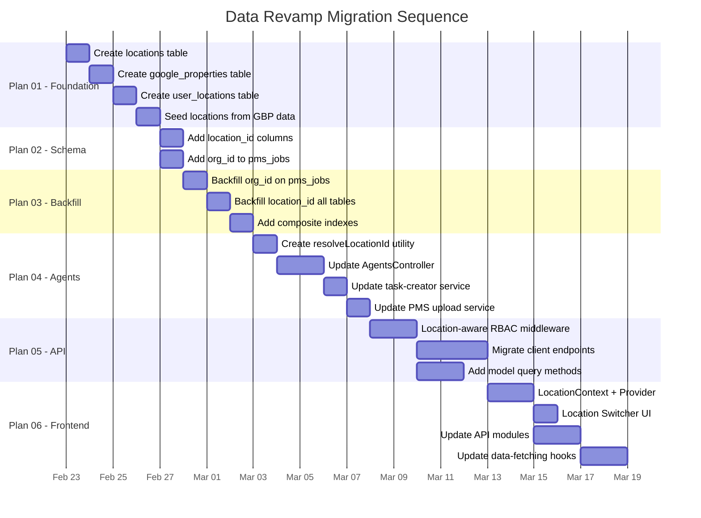

# Data Architecture — Before & After

## CURRENT Architecture (Before)

```mermaid
erDiagram
    users {
        int id PK
        string email
        string password_hash
        string first_name
        string last_name
        string phone
    }

    organizations {
        int id PK
        string name
        string domain
        string subscription_tier
        boolean onboarding_completed
        jsonb setup_progress
    }

    organization_users {
        int user_id FK
        int organization_id FK
        string role
    }

    google_connections {
        int id PK
        int organization_id FK
        string google_user_id
        string email
        string refresh_token
        jsonb google_property_ids
    }

    agent_results {
        int id PK
        int organization_id FK "nullable"
        string domain "scoping key"
        string agent_type
        jsonb agent_output
        string status
    }

    agent_recommendations {
        int id PK
        int agent_result_id FK
        string verdict
        string status
    }

    tasks {
        int id PK
        int organization_id FK "nullable"
        string domain_name "scoping key"
        string title
        string category
        string status
    }

    pms_jobs {
        int id PK
        string domain "ONLY scoping key"
        string status
        jsonb response_log
        jsonb automation_status_detail
    }

    practice_rankings {
        int id PK
        int organization_id FK "nullable"
        string domain
        string gbp_location_id "GBP API string"
        string status
        jsonb llm_analysis
    }

    notifications {
        int id PK
        int organization_id FK "nullable"
        string domain_name "scoping key"
        string title
        string type
    }

    website_builder_projects {
        uuid id PK
        int organization_id FK
        string status
        string generated_hostname
    }

    users ||--o{ organization_users : "belongs to"
    organizations ||--o{ organization_users : "has members"
    organizations ||--o{ google_connections : "has connections"
    agent_results ||--o{ agent_recommendations : "has recommendations"
    organizations ||--o{ website_builder_projects : "has website"

    %% PROBLEM: These tables use domain string, not FK
    %% agent_results --- organizations : "via domain string (loose)"
    %% tasks --- organizations : "via domain string (loose)"
    %% pms_jobs --- organizations : "NO relationship!"
    %% notifications --- organizations : "via domain string (loose)"
```

### Problems with Current Architecture

1. **`pms_jobs`** has NO organization_id — data scoped only by domain string
2. **`agent_results`**, **`tasks`**, **`notifications`** have nullable org_id and primarily query by domain string
3. **No location concept** — all data is flat per-organization
4. **GBP locations stored as JSON blob** in `google_connections.google_property_ids`
5. **No per-user location scoping** — all users see all org data

---

## NEW Architecture (After)

---

## Data Access Flow (New)

---

## Agent Execution Flow (New)

---

## Location Hierarchy

---

## Migration Sequence

